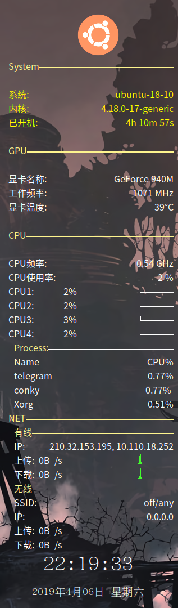

## Introduction
I am going to design an elegant conky to make my laptop more beautiful. The functions are below.
- System message
- GPU message
- CPU message
- NET message
- a simple clock

TO DO
- weather module
- a better clock
- disk message module

Dependence
- navidia gpu
- wqy and KaiTi font
- conky 1.10.8

Shortages
1. I can't detect the GPU name automatically.
2. I can't detect the net interface automatically.

So please change them by your self.
## Include
|file|location|
|-|-|
|.conkyrc|https://github.com/zjuyk/conky/.conkrc|
|images|https://github.com/zjuyk/conky/images/|
## Archived

